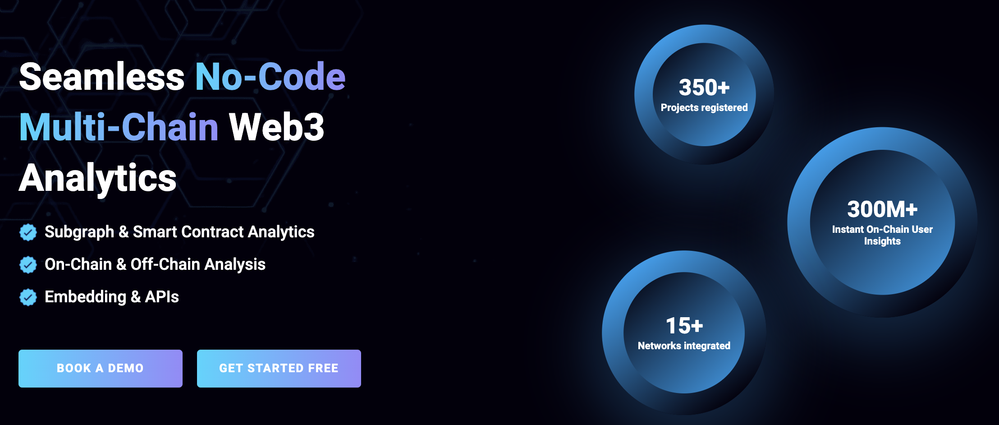

# Subgraph Query Workshop 2023

## [Workshop Slides](https://docs.google.com/presentation/d/1U64NOtOCXJEi9J3jmM0DhpuozgZg-eXoGE8KCZ2cczQ/edit?usp=sharing)

[](https://docs.google.com/presentation/d/1U64NOtOCXJEi9J3jmM0DhpuozgZg-eXoGE8KCZ2cczQ/edit?usp=sharing)

## Steps to send queries

1. Create an API key in [Subgraph Studio](https://www.thegraph.com/studio)
2. Search `<API_KEY>` in this repo and replace all `<API_KEY>`'s' with your new API Key
3. Send your demo queries!

---

## Subgraph Being Queried

[](https://thegraph.com/explorer/subgraphs/CBf1FtUKFnipwKVm36mHyeMtkuhjmh4KHzY3uWNNq5ow?view=Overview&chain=arbitrum-one)

## Subgraph's Endpoint

`https://gateway-arbitrum.network.thegraph.com/api/[api-key]/subgraphs/id/CBf1FtUKFnipwKVm36mHyeMtkuhjmh4KHzY3uWNNq5ow`

The demo query retrieves the top 5 accounts with the most tokens in specific collections, along with the first token's collection details such as name, symbol, and total volume for each of these top accounts.

```graphql
{
	accountCollections(orderBy: tokenCount, orderDirection: desc, first: 5) {
		account {
			id
			tokens(first: 1) {
				collection {
					name
					symbol
					totalVolume
				}
			}
		}
		tokenCount
	}
}
```

## Send a Vanilla JS Query

1. `cd vanilla-js-query`
2. `open javascriptQuery.html`

## Send a Python Query

1. `cd flask-query`
2. `pip install Flask requests`
3. `python app.py`
4. Open the development server that appears in the terminal to see the query response: (http://127.0.0.1:5000)

## Send a Graph Client Query

-   See this [walkthrough video](https://www.youtube.com/watch?v=ZsRAmyUtvwg) for a great overview of [graph-client](https://github.com/graphprotocol/graph-client)

1. `cd graph-client-query`
2. `npm install`
3. `npm run dev` to set up GraphQL explorer (See terminal for link). We can now send test queries from our localhost
4. `npm run codegen` to build an a new SDK that we can integrate with our dapp
5. `npm run start` to send our test query and see responses in the terminal.

## Send a React Apollo Query

1. `npm install`
2. `npm run start` to send test query and see responses at http://localhost:3000

## More Querying Options

### Playgrounds for Subgraph Data Analytics

[](https://playgrounds.network/)

### DappLooker for No-Code Dashboards

[](https://dapplooker.com/home)
